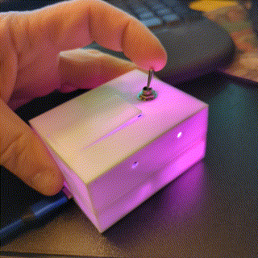
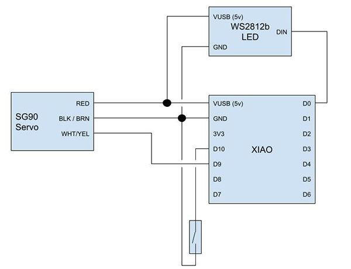
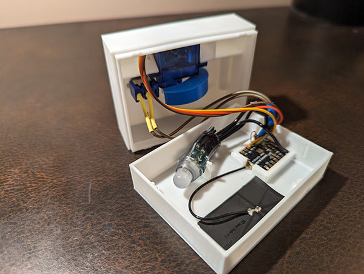

# Useless Box with LED
This was originally created as a Secret Santa gift for our office gift exchange but quickly became a fun item to teach some STEM basics.  It is based on [this project on Thingiverse](https://www.thingiverse.com/thing:415296).  This version adds some "personality" and an optional multicolor LED.

## Materials
- SG90 Micro Servo Motor, available from many sources.  [Here's a 5-pack](https://www.amazon.com/Dorhea-Arduino-Helicopter-Airplane-Walking/dp/B07Q6JGWNV/) and [One on Digikey](https://www.digikey.com/en/products/detail/gearbox-labs/PART-MICRO-SERVO-SG-90-ANALOG/16159912)
- XIAO ESP32C23 Microcontroller [Seeed Studio](https://www.seeedstudio.com/Seeed-XIAO-ESP32C3-p-5431.html) | [Buy on digikey](https://www.digikey.com/en/products/detail/seeed-technology-co-ltd/113991054/16652880)
- SPST or SPDT Toggle Switch [Here's one from DigiKey](https://www.digikey.com/en/products/detail/nte-electronics,-inc/54-301PC/11647755)
- Optional 5V WS2812B LED - Available from many sources.  You can potentially just cut one off of an existing string.

## Assembly
1. **Print the case** - Follow the [excellent instructions by SjFleischmann](https://www.thingiverse.com/thing:415296) to print and assemble the case.  The STLs in this repo are tailored for the Seeed XIAO controllers though you can follow SjFleischmann's instructions to print a base for an Arduino Uno.  Note the addition of the optional LED.

2. **Connect the electronics**

3. **Program the Unit** - I recommend programming the unit before fully installing it in the case so as to calibrate the position of the arm on the servo.  Once inside the case, this position is harder to adjust and, if positioned incorrectly, may result in damage to the unit.  [Seeed's Wiki](https://wiki.seeedstudio.com/XIAO_ESP32C3_Getting_Started/) has great instructions for setting up the development environment.

*A note on the ESP32: The original unit was built with an Arduino Uno using FastLED and the built-in Servo library.  Neither of these libraries work on the ESP32 so conditional compilation was added to support both the Uno and ESP32-based Arduinos.  Note that some Servo and some Addressable LED libraries take advantage of the ESP32's hardware timers--in some cases, both libraries use the same hardware timer, causing unpredictable behavior.  If you try with a different library and you run into trouble, try commenting out the LED libraries and code to simply establish baseline operation with the servo.*

4. **Test and install the mechanical pieces**
  - **Snap the microcontroller "upside-down" into the holder by the USB port opening.**  This can be a bit tricky; you will need to make sure the USB-C port protrudes into the wall of the computer and will need to press firmly on the rear of the PCB to snap it below the nubs holding it in place.  If the microcontroller breaks loose during normal operation due to strain on the USB port, you can add a dab of hot glue at the rear of the PCB to keep it from popping up.
  - **Test and install servo** I strongly recommend loosely connecting the arm to the servo before putting the servo in the case.  Try holding the servo in place while actuating the switch to find the right angle for the arm.
  - **Install the switch** Be sure the switch is in the "On" position when closest to the arm, and "Off" when away from the arm.

The inside of the assembled case should resemble this:

Your LED may differ significantly from the one pictured; virtually any WS2812B (or similar) LED will work.  The clip built into the case is designed to hold a 11mm LED but is easily removed or modified.  I suggest placing the LED and fixing it in place with hot glue.

The astute reader may notice the presence of the BLE/WIFI antenna...the XIAO ESP32C23 has BLE/WIFI capabilities so why not include the antenna?  The implementation of this feature will be left as an exercise for the reader.  You do not need to connect the antenna if you're simply using the default program.

## Teaching Opportunities
This unit provides a great platform for education; it can cost less than $10 per unit and can be used for a variety of lessons.  Here are some suggestions for additional areas of expansion:

1. **Customize the case** (easy) - Add a name or instruction text on the top of the case.
2. **Customize the LED colors** (easy) - What color says "good" and "bad" to you?  Customize the predefined color constants.
4. **Add additional random sequences** (5th-7th grade) - Increase the random number range and randomly select additional sequences.  Should it move slower?  Faster?  Does it poke out slightly, retract, and then wait for a second before springing out to shut off the switch?  Think about an animal popping out of a hole to grab a piece of food--how would it behave?  How does this organic behavior translate to a mechanical device?
5. **Add additional non-random sequences** (6th grade+) - Does the box get upset after you throw the switch too many times?  Does it start ignoring repeated flips?  Maybe there's an Easter Egg when a specific on/off sequence is detected.
7. **Use the BLE/WIFI antenna** (9th grade+) - Control the device from your phone or over the Internet.  Perhaps the LED becomes an indicator of some signal on the Internet (stock market, weather, etc) or maybe the switch actually does something in the real world.  The possibilities are endless.

## References
- [Original Project](https://www.thingiverse.com/thing:415296)
- [Arduino Servo Library](https://www.arduino.cc/reference/en/libraries/servo/detach/)
- [Using a servo with a Seeeduino](https://forum.arduino.cc/t/how-to-drive-fs90-9g-servo-with-seeduino/974645/3)
- [Using WS2812B LEDs with XIAO](https://mschoeffler.com/2022/02/15/xiao-ble-tutorial-how-to-control-a-ws2812b-led-strip-with-the-neopixel-library/)
