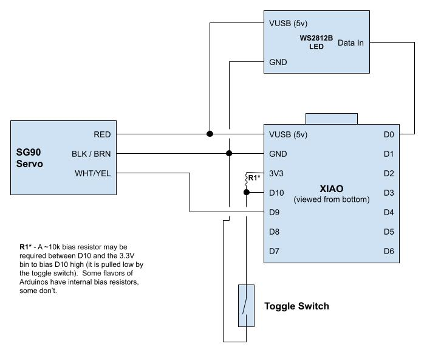

# Useless Box with LED
Originally created as a Secret Santa gift and as an item to teach some STEM basics, based on [Original Project](https://www.thingiverse.com/thing:415296).  This version adds some "personality" and an optional multicolor LED.

## Materials
- SG90 Micro Servo Motor, available from many sources.  [Here's a 5-pack](https://www.amazon.com/Dorhea-Arduino-Helicopter-Airplane-Walking/dp/B07Q6JGWNV/) and [One on Digikey](https://www.digikey.com/en/products/detail/gearbox-labs/PART-MICRO-SERVO-SG-90-ANALOG/16159912)
- XIAO ESP32C23 Microcontroller [Seeed Studio](https://www.seeedstudio.com/Seeed-XIAO-ESP32C3-p-5431.html) | [Buy on digikey](https://www.digikey.com/en/products/detail/seeed-technology-co-ltd/113991054/16652880)
- SPST or SPDT Toggle Swtich [Here's one from DigiKey](https://www.digikey.com/en/products/detail/nte-electronics,-inc/54-301PC/11647755)
- Optional 5V WS2812B LED - Available from many sources.  You can potentially just cut one off of an existing string.

## Assembly
Follow the [excellent instructions by SjFleischmann](https://www.thingiverse.com/thing:415296) to print and assemble the case.  The STLs in this repo are tailored for the Seeed XIAO controllers.  Note the addition of the optional LED.

## Tips on connecting the servo
I strongly recommend loosly connecting the arm to the servo before putting the servo in the case.  Try holding the servo in place while actuating the switch to find the right angle for the arm.

## References
- [Original Project](https://www.thingiverse.com/thing:415296)
- [Arduino Servo Library](https://www.arduino.cc/reference/en/libraries/servo/detach/)
- [Using a servo with a Seeeduino](https://forum.arduino.cc/t/how-to-drive-fs90-9g-servo-with-seeduino/974645/3)
- [Using WS2812B LEDs with XIAO](https://mschoeffler.com/2022/02/15/xiao-ble-tutorial-how-to-control-a-ws2812b-led-strip-with-the-neopixel-library/)
